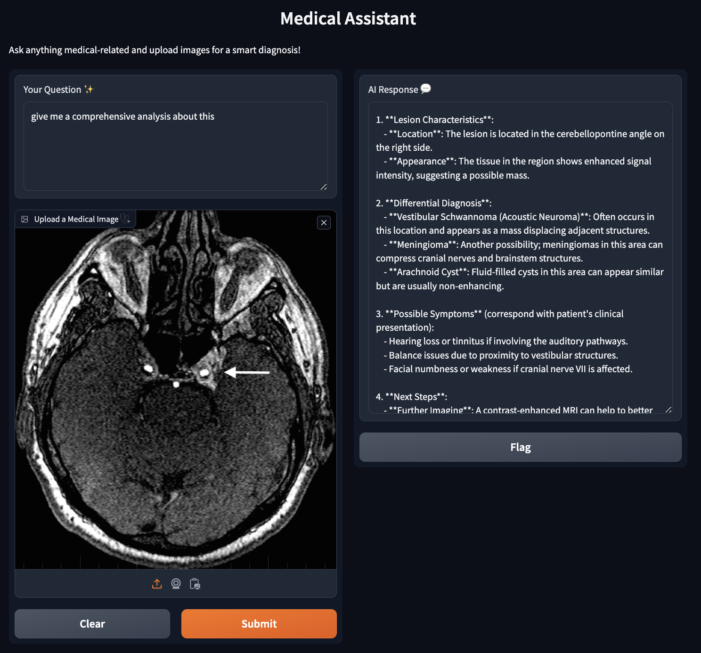

# 🏥 Medical Assistant Chatbot with Multimodal Retrieval-Augmented Generation (RAG) 🤖🩺

This project is a **Multimodal AI Assistant** built using **Gradio** and **CLIP-based models**. It allows users to ask medical-related questions and upload relevant medical images for smart diagnosis. The assistant combines text and image embeddings to provide relevant and accurate responses, leveraging the power of **Retrieval-Augmented Generation (RAG)**.

This project implements a medical assistant chatbot that leverages multimodal Retrieval-Augmented Generation (RAG) to provide insightful answers to medical-related queries. Users can ask questions and upload relevant medical images for analysis. The system uses OpenAI's GPT models, CLIP-based models for embedding, and integrates with Qdrant, a vector database, for efficient retrieval.

## Features

- **Multimodal Input**: Accepts both text queries and medical images.
- **Advanced Embeddings**: Utilizes CLIP-based models via the `fastembed` library for text and image embeddings.
- **Vector Database Integration**: Stores and retrieves embeddings using Qdrant.
- **User-Friendly Interface**: Built with Gradio for an interactive web experience.


Here is an example of the result generated by the system:




## Table of Contents

- [Installation](#installation)
  - [Prerequisites](#prerequisites)
  - [Clone the Repository](#clone-the-repository)
  - [Install Dependencies](#install-dependencies)
  - [Set Up Environment Variables](#set-up-environment-variables)
- [Usage](#usage)
  - [Running the Application](#running-the-application)
  - [Interacting with the Chatbot](#interacting-with-the-chatbot)

## Installation

### Prerequisites

- Python 3.7 or higher
- pip (Python package manager)
- Git (for cloning the repository)

### Clone the Repository

Just clone the repository

### Install Dependencies

It's recommended to use a virtual environment:

```bash
python -m venv venv
source venv/bin/activate  # On Windows use `venv\Scripts\activate`
```

Install the required packages:

```bash
pip install -r requirements.txt
```

**Contents of `requirements.txt`:**

```
fastembed==0.3.6
pandas==2.2.2
python-dotenv>=1.0.1
requests>=2.32.3
gradio>=4.44.0
pillow>=10.4.0
```

### Set Up Environment Variables

Create a `.env` file in the root directory and add your API keys:

```env
OPENAI_API_KEY="your-openai-api-key"
QDRANT_API_KEY="your-qdrant-api-key"
QDRANT_HOST="your-qdrant-host"
```

- Replace `"your-openai-api-key"` with your actual OpenAI API key.
- Replace `"your-qdrant-api-key"` and `"your-qdrant-host"` with your Qdrant credentials.

## Usage

### Running the Application

To start the chatbot interface, run:

```bash
python src/main.py
```

This will launch a Gradio web interface locally. Access it by opening the URL provided in the terminal (usually `http://127.0.0.1:7860/`) in your web browser.

### Interacting with the Chatbot

- **Text Input**: Enter your medical-related question in the **Your Question ✨** textbox.
- **Image Upload**: Optionally, upload a medical image using the **Upload a Medical Image 🩺** button.
- **Get Response**: Click **Submit** to receive an AI-generated response in the **AI Response 💬** textbox.
